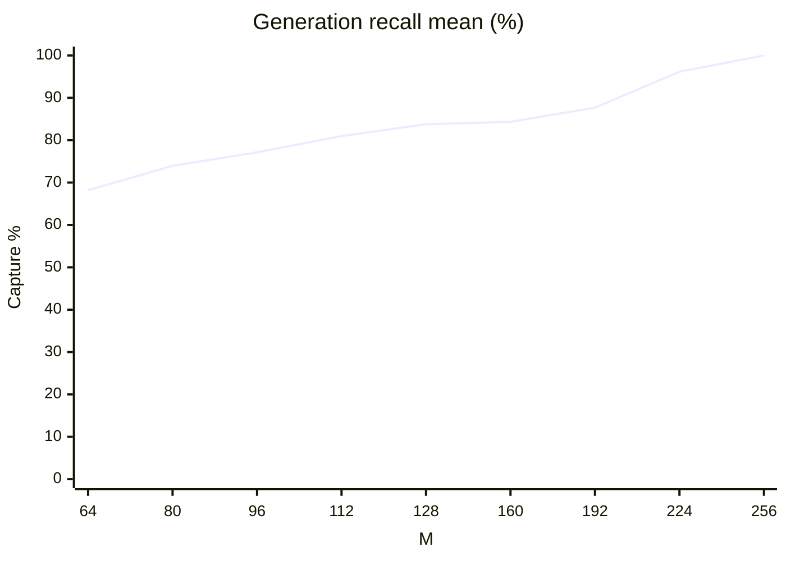
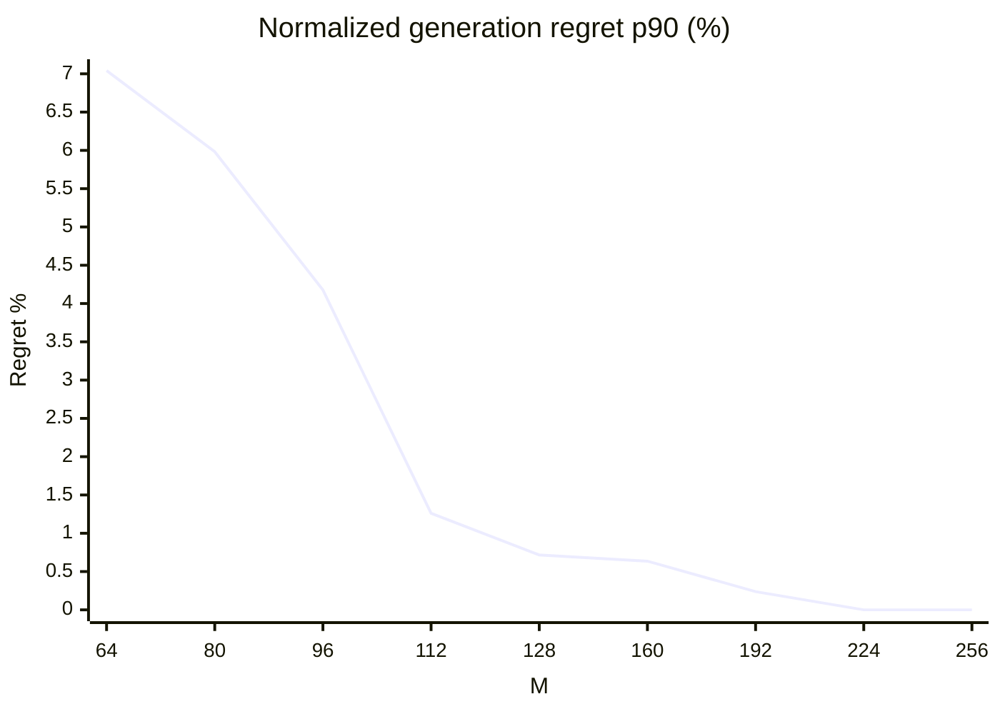
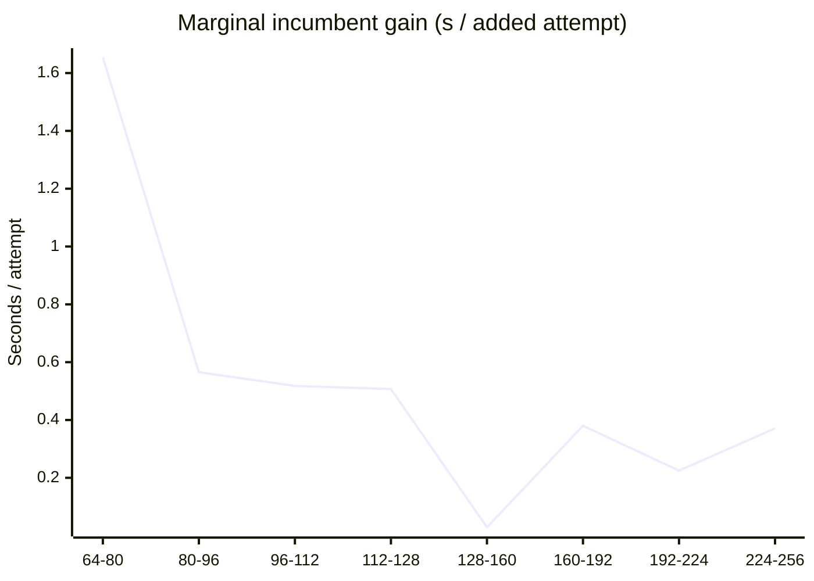

# Phase4-0B：候选池规模、materiality 与筛选损失分析

Phase4-0B: PASS；推荐候选池 M*=192；generation materiality=CLOSED；剩余瓶颈=C2+C4；MLP next=YES。

只读取既有 72 states / 10,701 labels；没有重新生成候选、优化方向、调用 reference/certifier 或运行 trajectory。生产 M64/Kdp8/Kref2 保持。只分析原 RANKER_DEV，不打开训练、validation 或 test workbook。历史 Phase4-0 文件不改写。

## 口径与 NULL

按 atomic 前 3M/4 次、LNS 前 M/4 次截取，保留历史块顺序（48A+16L、48A+16L、96A+32L）中的相对次序。不能直接取混合总流前 M 次。前缀内按完整 canonical solution 去重；原先与被移除 atomic 重复的 LNS 可成为首个代表，仍复用同一完整解的现有标签。中间档位的完整解集合嵌套，代表 candidate identity 可能替换。实际生产更改 M 时仍需另行验证运行实现和成本。

分位数使用 sorted values 的 (n−1)q 线性插值；主统计每 state 等权。Generation recall 以 I256 为分母，沿用 Phase4-0 epsilon。materiality 四组按有符号 (Cs−C256*)/Cs 判断，全部报告，不用阈值挑选实例。regret 以 Cs 归一化，数值均为比例。

C* 无可行候选时为 NULL，公式 regret 也为 NULL，不填零；报告给出 undefined 数。M* 选择额外使用已有 certified incumbent：CM* 缺失但 C256* 存在时，保守损失为 max(0,Cs−C256*)/Cs；两者均缺失时无有限池改善机会。既有有限 C* 的用户公式原样保留。

筛选 recall 同时给出用户原式的 signed recall=(Cs−Cselected*)/(Cs−CM*)，可能为负，以及与 Phase4-0 可比的非负 capture recall=max(0,Cs−Cselected*)/(Cs−CM*)。selected C* 为 NULL 时 signed recall/regret 为 NULL，zero capture 仍计入分母；非负 capture recall 用已认证 incumbent 的零改善，绝非给不可行 candidate 填零 Cmax。normalized screening regret 原式不截断，同时给出执行 incumbent fallback 的 regret。

## 15 个问题的直接回答

1. Phase4-0 中 M64 recall<75% 的状态有 27 个，其中 oracle 改善<0.1% 的只有 0 个、≥0.5% 的有 22 个、≥1% 的有 20 个。更关键的是，其中 22 个状态因 M64 漏解实际损失≥当前 makespan 的0.5%，19 个损失≥1%；实际 normalized regret median=4.330%、p90=15.732%。因此不能把原 FAIL 解释为许多极小改善造成的假象。四组嵌套计数不能相加。
2. 九个 M 的完整 generation 曲线见 ALL 与各 tier/stage 表；同时保留中位、均值、四分位及 regret 尾部。
3. 按连续64个新增 attempts 归并，64→128、128→192、192→256 的每新增 attempt 平均 incumbent 改善分别为 0.811、0.204、0.298 秒。后段边际收益低于前段，体现总体 diminishing returns；M128 是否够用由四条件决定，其结果=False；不能因中位捕获100%就说128后已饱和。达到工程容忍度的位置为 M192，不是宣称其后收益严格为零。
4. 按用户给定四条件选择的全局最小 M*=192，不按 tier 单独配置。
5. 前一档 M160 未满足：p90_regret_at_most_0.5pct；M192 是首次四项均通过的档位。M256 提供更强有限池 oracle，但多生成并不自动抵消生成/筛选成本；本轮没有测量改 M 后的生产 runtime。这里只推荐离线池规模，未修改配置。
6. M* 下有效 unique 每状态均值 114.417、中位 115.000。
7. M* 每状态平均 duplicate=41.653、construction reject=28.333；duplicate/reject/identity/raw reject 合计占 40.408%，浪费明显且仍占预算、不补抽。
8. M* 自身改善≥0.5% 的状态 n=56；C2 capture recall median=6.358%，signed recall median=12.365%，zero capture=35.714%。
9. 同一组 material states 中，C4 capture recall median=0.000%，signed recall median=4.280%，zero capture=69.643%。使用相同 Kref2、方向 rerank 和 family policy，ID 来自生产函数，标签直接复用；signed 与 capture 分母样本差别见 NULL 口径。
10. SMALL/MEDIUM/LARGE 与 EARLY/MID/LATE 分别给出，不把候选混池计算平均。
11. LARGE 的 material generation 与 screening 结果单独比较，见下文；只表述 consistent with，不作退化因果断言。
12. 现有 Phase4-0 已显示 M256 oracle-best 主要为 STRUCTURAL/WHOLE，LARGE 的 Y/X 没有达到 M256 最优；本轮没有支持修改 X/Y 规则的新证据，不修改 proposal/quota/split。
13. 未来可研究 M192；当前生产仍为 M64。
14. MLP 科学动机：成立：有工程意义的改善已在推荐池内，而 C4 在 material states 仍有明显损失。
15. 下一步：Phase4-1 MLP candidate ranker: freeze features and training design in a separate task。本轮到分析报告停止，不建网络、不训练、不拟合标准化。

## M* 四条件选择

选择表使用含 certified incumbent fallback 的保守口径；后面的 generation 曲线表原样报告公式仅有限值的 regret。仅使用公式有限值重新选择，最小 M 同样为 192，结论不依赖 NULL 处理。

| M | median regret | p90 regret | material n | material recall≥80% 比例 | material zero | 满足 |
|---|---|---|---|---|---|---|
| 64 | 0.000% | 7.042% | 59 | 61.017% | 8.475% | False |
| 80 | 0.000% | 5.982% | 59 | 69.492% | 6.780% | False |
| 96 | 0.000% | 4.177% | 59 | 72.881% | 6.780% | False |
| 112 | 0.000% | 1.261% | 59 | 79.661% | 6.780% | False |
| 128 | 0.000% | 0.717% | 59 | 86.441% | 6.780% | False |
| 160 | 0.000% | 0.636% | 59 | 86.441% | 3.390% | False |
| 192 | 0.000% | 0.238% | 59 | 89.831% | 1.695% | True |
| 224 | 0.000% | 0.000% | 59 | 98.305% | 1.695% | True |
| 256 | 0.000% | 0.000% | 59 | 100.000% | 0.000% | True |

## Generation：ALL

| M | unique mean/median | recall mean/median/p25/p75 | regret median/p75/p90/p95/max | regret NA | zero capture |
|---|---|---|---|---|---|
| 64 | 42.417/43.000 | 68.195%/99.984%/30.644%/100.000% | 0.000%/1.170%/6.215%/8.373%/13.631% | 4 | 14.706% |
| 80 | 51.750/52.000 | 73.946%/100.000%/47.626%/100.000% | 0.000%/0.657%/4.401%/6.548%/13.611% | 3 | 13.235% |
| 96 | 61.167/61.500 | 77.134%/100.000%/63.831%/100.000% | 0.000%/0.186%/2.351%/5.551%/13.611% | 3 | 11.765% |
| 112 | 69.986/70.000 | 80.971%/100.000%/89.694%/100.000% | 0.000%/0.049%/0.814%/3.708%/13.611% | 3 | 11.765% |
| 128 | 78.889/80.000 | 83.756%/100.000%/98.532%/100.000% | 0.000%/0.001%/0.661%/0.975%/13.611% | 3 | 11.765% |
| 160 | 97.042/99.000 | 84.335%/100.000%/99.817%/100.000% | 0.000%/0.000%/0.552%/0.701%/13.611% | 3 | 7.353% |
| 192 | 114.417/115.000 | 87.678%/100.000%/100.000%/100.000% | 0.000%/0.000%/0.192%/0.697%/13.611% | 2 | 5.882% |
| 224 | 132.083/134.000 | 96.159%/100.000%/100.000%/100.000% | 0.000%/0.000%/0.000%/0.001%/1.324% | 2 | 2.941% |
| 256 | 148.625/150.500 | 100.000%/100.000%/100.000%/100.000% | 0.000%/0.000%/0.000%/0.000%/0.000% | 1 | 0.000% |

每状态平均尝试分类（括号外 unique，状态总数另存 JSON；每 state 固定 M 次）：

| M | unique | CONSTRUCTION_REJECTED | IDENTITY | DUPLICATE | DIRECTION_INFEASIBLE | FEASIBLE_CERTIFIED | DEADLOCK |
|---|---|---|---|---|---|---|---|
| 64 | 42.417 | 9.542 | 2.431 | 9.611 | 1.181 | 22.625 | 18.611 |
| 80 | 51.750 | 12.056 | 3.125 | 13.069 | 1.472 | 27.194 | 23.083 |
| 96 | 61.167 | 14.417 | 3.847 | 16.569 | 1.694 | 32.069 | 27.403 |
| 112 | 69.986 | 16.778 | 4.417 | 20.819 | 1.861 | 36.708 | 31.417 |
| 128 | 78.889 | 19.056 | 5.069 | 24.986 | 2.111 | 41.319 | 35.458 |
| 160 | 97.042 | 23.667 | 6.236 | 33.056 | 2.542 | 50.778 | 43.722 |
| 192 | 114.417 | 28.333 | 7.597 | 41.653 | 2.972 | 59.694 | 51.750 |
| 224 | 132.083 | 33.139 | 8.861 | 49.917 | 3.569 | 68.694 | 59.819 |
| 256 | 148.625 | 37.806 | 10.167 | 59.403 | 4.028 | 76.944 | 67.653 |

边际收益（均值；C* gain 排除缺失配对，incumbent gain 包含零捕获→捕获）：

| 档位 | 新增 attempts | 新增 unique/FEASIBLE | 新增 dup/reject | 首次捕获状态 | C* gain s | incumbent gain s | gain s/attempt |
|---|---|---|---|---|---|---|---|
| 64→80 | 16 | 9.333/4.569 | 3.458/2.514 | 1 | 16.083 | 26.467 | 1.654 |
| 80→96 | 16 | 9.417/4.875 | 3.500/2.361 | 1 | 9.428 | 9.035 | 0.565 |
| 96→112 | 16 | 8.819/4.639 | 4.250/2.361 | 0 | 8.647 | 8.287 | 0.518 |
| 112→128 | 16 | 8.903/4.611 | 4.167/2.278 | 0 | 8.470 | 8.117 | 0.507 |
| 128→160 | 32 | 18.153/9.458 | 8.069/4.611 | 3 | 0.958 | 0.918 | 0.029 |
| 160→192 | 32 | 17.375/8.917 | 8.597/4.667 | 1 | 0.912 | 12.151 | 0.380 |
| 192→224 | 32 | 17.667/9.000 | 8.264/4.806 | 2 | 7.416 | 7.210 | 0.225 |
| 224→256 | 32 | 16.542/8.250 | 9.486/4.667 | 2 | 0.616 | 11.876 | 0.371 |

## Generation：SMALL

| M | unique mean/median | recall mean/median/p25/p75 | regret median/p75/p90/p95/max | regret NA | zero capture |
|---|---|---|---|---|---|
| 64 | 39.875/39.500 | 60.378%/93.169%/18.082%/100.000% | 0.000%/2.326%/6.951%/10.924%/13.631% | 0 | 14.286% |
| 80 | 48.417/48.000 | 66.199%/100.000%/23.413%/100.000% | 0.000%/0.858%/6.049%/10.856%/13.611% | 0 | 14.286% |
| 96 | 57.083/57.000 | 70.251%/100.000%/23.413%/100.000% | 0.000%/0.186%/3.885%/10.564%/13.611% | 0 | 14.286% |
| 112 | 65.542/65.000 | 77.121%/100.000%/93.169%/100.000% | 0.000%/0.047%/0.851%/4.156%/13.611% | 0 | 14.286% |
| 128 | 73.375/73.500 | 81.742%/100.000%/100.000%/100.000% | 0.000%/0.000%/0.186%/0.993%/13.611% | 0 | 14.286% |
| 160 | 89.333/89.000 | 82.067%/100.000%/100.000%/100.000% | 0.000%/0.000%/0.186%/0.186%/13.611% | 0 | 14.286% |
| 192 | 105.250/106.500 | 82.067%/100.000%/100.000%/100.000% | 0.000%/0.000%/0.186%/0.186%/13.611% | 0 | 14.286% |
| 224 | 119.583/119.000 | 94.883%/100.000%/100.000%/100.000% | 0.000%/0.000%/0.000%/0.158%/1.324% | 0 | 4.762% |
| 256 | 133.667/133.000 | 100.000%/100.000%/100.000%/100.000% | 0.000%/0.000%/0.000%/0.000%/0.000% | 0 | 0.000% |

每状态平均尝试分类（括号外 unique，状态总数另存 JSON；每 state 固定 M 次）：

| M | unique | CONSTRUCTION_REJECTED | IDENTITY | DUPLICATE | DIRECTION_INFEASIBLE | FEASIBLE_CERTIFIED | DEADLOCK |
|---|---|---|---|---|---|---|---|
| 64 | 39.875 | 9.250 | 5.083 | 9.792 | 1.250 | 25.833 | 12.792 |
| 80 | 48.417 | 11.542 | 6.292 | 13.750 | 1.542 | 30.708 | 16.167 |
| 96 | 57.083 | 13.708 | 7.792 | 17.417 | 1.750 | 36.333 | 19.000 |
| 112 | 65.542 | 15.833 | 8.875 | 21.750 | 2.042 | 41.458 | 22.042 |
| 128 | 73.375 | 18.000 | 10.250 | 26.375 | 2.208 | 46.500 | 24.667 |
| 160 | 89.333 | 22.667 | 12.708 | 35.292 | 2.875 | 56.167 | 30.292 |
| 192 | 105.250 | 26.917 | 15.333 | 44.500 | 3.333 | 65.583 | 36.333 |
| 224 | 119.583 | 31.917 | 18.250 | 54.250 | 4.250 | 74.167 | 41.167 |
| 256 | 133.667 | 36.292 | 20.958 | 65.083 | 4.875 | 82.458 | 46.333 |

边际收益（均值；C* gain 排除缺失配对，incumbent gain 包含零捕获→捕获）：

| 档位 | 新增 attempts | 新增 unique/FEASIBLE | 新增 dup/reject | 首次捕获状态 | C* gain s | incumbent gain s | gain s/attempt |
|---|---|---|---|---|---|---|---|
| 64→80 | 16 | 8.542/4.875 | 3.958/2.292 | 0 | 8.899 | 8.899 | 0.556 |
| 80→96 | 16 | 8.667/5.625 | 3.667/2.167 | 0 | 5.906 | 5.906 | 0.369 |
| 96→112 | 16 | 8.458/5.125 | 4.333/2.125 | 0 | 13.663 | 13.663 | 0.854 |
| 112→128 | 16 | 7.833/5.042 | 4.625/2.167 | 0 | 2.543 | 2.543 | 0.159 |
| 128→160 | 32 | 15.958/9.667 | 8.917/4.667 | 0 | 0.847 | 0.847 | 0.026 |
| 160→192 | 32 | 15.917/9.417 | 9.208/4.250 | 0 | 0.000 | 0.000 | 0.000 |
| 192→224 | 32 | 14.333/8.583 | 9.750/5.000 | 2 | 13.036 | 13.036 | 0.407 |
| 224→256 | 32 | 14.083/8.292 | 10.833/4.375 | 1 | 1.486 | 1.486 | 0.046 |

## Generation：MEDIUM

| M | unique mean/median | recall mean/median/p25/p75 | regret median/p75/p90/p95/max | regret NA | zero capture |
|---|---|---|---|---|---|
| 64 | 43.750/44.000 | 64.532%/86.687%/31.034%/100.000% | 0.000%/4.444%/6.685%/9.259%/12.945% | 4 | 17.391% |
| 80 | 53.208/53.000 | 72.669%/100.000%/52.225%/100.000% | 0.000%/2.238%/6.126%/6.421%/12.738% | 3 | 13.043% |
| 96 | 63.042/62.500 | 76.891%/100.000%/63.594%/100.000% | 0.000%/0.721%/4.330%/6.126%/6.421% | 3 | 13.043% |
| 112 | 71.792/70.000 | 81.962%/100.000%/88.260%/100.000% | 0.000%/0.001%/2.238%/5.691%/6.126% | 3 | 13.043% |
| 128 | 81.458/81.500 | 85.966%/100.000%/97.788%/100.000% | 0.000%/0.001%/0.644%/0.721%/1.294% | 3 | 13.043% |
| 160 | 100.542/100.000 | 86.908%/100.000%/99.657%/100.000% | 0.000%/0.000%/0.592%/0.641%/1.294% | 3 | 8.696% |
| 192 | 118.458/117.000 | 91.514%/100.000%/100.000%/100.000% | 0.000%/0.000%/0.102%/0.568%/1.294% | 2 | 4.348% |
| 224 | 136.750/136.500 | 95.651%/100.000%/100.000%/100.000% | 0.000%/0.000%/0.000%/0.000%/0.001% | 2 | 4.348% |
| 256 | 154.292/153.000 | 100.000%/100.000%/100.000%/100.000% | 0.000%/0.000%/0.000%/0.000%/0.000% | 1 | 0.000% |

每状态平均尝试分类（括号外 unique，状态总数另存 JSON；每 state 固定 M 次）：

| M | unique | CONSTRUCTION_REJECTED | IDENTITY | DUPLICATE | DIRECTION_INFEASIBLE | FEASIBLE_CERTIFIED | DEADLOCK |
|---|---|---|---|---|---|---|---|
| 64 | 43.750 | 9.583 | 1.292 | 9.375 | 1.625 | 16.625 | 25.500 |
| 80 | 53.208 | 12.208 | 1.750 | 12.833 | 1.833 | 20.125 | 31.250 |
| 96 | 63.042 | 14.542 | 2.125 | 16.292 | 2.167 | 23.917 | 36.958 |
| 112 | 71.792 | 17.042 | 2.375 | 20.792 | 2.208 | 27.250 | 42.333 |
| 128 | 81.458 | 18.958 | 2.750 | 24.833 | 2.583 | 30.958 | 47.917 |
| 160 | 100.542 | 23.458 | 3.458 | 32.542 | 3.000 | 38.375 | 59.167 |
| 192 | 118.458 | 28.208 | 4.250 | 41.083 | 3.625 | 45.208 | 69.625 |
| 224 | 136.750 | 33.417 | 4.667 | 49.167 | 4.333 | 52.000 | 80.417 |
| 256 | 154.292 | 38.000 | 5.250 | 58.458 | 4.792 | 58.458 | 91.042 |

边际收益（均值；C* gain 排除缺失配对，incumbent gain 包含零捕获→捕获）：

| 档位 | 新增 attempts | 新增 unique/FEASIBLE | 新增 dup/reject | 首次捕获状态 | C* gain s | incumbent gain s | gain s/attempt |
|---|---|---|---|---|---|---|---|
| 64→80 | 16 | 9.458/3.500 | 3.458/2.625 | 1 | 31.068 | 59.722 | 3.733 |
| 80→96 | 16 | 9.833/3.792 | 3.458/2.333 | 0 | 23.433 | 20.504 | 1.282 |
| 96→112 | 16 | 8.750/3.333 | 4.500/2.500 | 0 | 12.797 | 11.197 | 0.700 |
| 112→128 | 16 | 9.667/3.708 | 4.042/1.917 | 0 | 24.897 | 21.785 | 1.362 |
| 128→160 | 32 | 19.083/7.417 | 7.708/4.500 | 1 | 1.852 | 1.620 | 0.051 |
| 160→192 | 32 | 17.917/6.833 | 8.542/4.750 | 1 | 1.077 | 34.775 | 1.087 |
| 192→224 | 32 | 18.292/6.792 | 8.083/5.208 | 0 | 3.529 | 3.235 | 0.101 |
| 224→256 | 32 | 17.542/6.458 | 9.292/4.583 | 1 | 0.002 | 33.834 | 1.057 |

## Generation：LARGE

| M | unique mean/median | recall mean/median/p25/p75 | regret median/p75/p90/p95/max | regret NA | zero capture |
|---|---|---|---|---|---|
| 64 | 43.625/44.000 | 78.545%/100.000%/71.259%/100.000% | 0.000%/0.423%/0.936%/1.241%/4.125% | 0 | 12.500% |
| 80 | 53.625/53.500 | 81.949%/100.000%/92.545%/100.000% | 0.000%/0.071%/0.671%/0.992%/1.275% | 0 | 12.500% |
| 96 | 63.375/63.500 | 83.390%/100.000%/92.545%/100.000% | 0.000%/0.071%/0.671%/0.725%/1.275% | 0 | 8.333% |
| 112 | 72.625/71.500 | 83.390%/100.000%/92.545%/100.000% | 0.000%/0.071%/0.671%/0.725%/1.275% | 0 | 8.333% |
| 128 | 81.833/81.000 | 83.401%/100.000%/92.736%/100.000% | 0.000%/0.061%/0.671%/0.725%/1.275% | 0 | 8.333% |
| 160 | 101.250/101.000 | 83.853%/100.000%/94.086%/100.000% | 0.000%/0.059%/0.620%/0.721%/1.275% | 0 | 0.000% |
| 192 | 119.542/118.500 | 88.911%/100.000%/100.000%/100.000% | 0.000%/0.000%/0.530%/0.721%/1.107% | 0 | 0.000% |
| 224 | 139.917/139.500 | 97.761%/100.000%/100.000%/100.000% | 0.000%/0.000%/0.000%/0.000%/0.151% | 0 | 0.000% |
| 256 | 157.917/155.500 | 100.000%/100.000%/100.000%/100.000% | 0.000%/0.000%/0.000%/0.000%/0.000% | 0 | 0.000% |

每状态平均尝试分类（括号外 unique，状态总数另存 JSON；每 state 固定 M 次）：

| M | unique | CONSTRUCTION_REJECTED | IDENTITY | DUPLICATE | DIRECTION_INFEASIBLE | FEASIBLE_CERTIFIED | DEADLOCK |
|---|---|---|---|---|---|---|---|
| 64 | 43.625 | 9.792 | 0.917 | 9.667 | 0.667 | 25.417 | 17.542 |
| 80 | 53.625 | 12.417 | 1.333 | 12.625 | 1.042 | 30.750 | 21.833 |
| 96 | 63.375 | 15.000 | 1.625 | 16.000 | 1.167 | 35.958 | 26.250 |
| 112 | 72.625 | 17.458 | 2.000 | 19.917 | 1.333 | 41.417 | 29.875 |
| 128 | 81.833 | 20.208 | 2.208 | 23.750 | 1.542 | 46.500 | 33.792 |
| 160 | 101.250 | 24.875 | 2.542 | 31.333 | 1.750 | 57.792 | 41.708 |
| 192 | 119.542 | 29.875 | 3.208 | 39.375 | 1.958 | 68.292 | 49.292 |
| 224 | 139.917 | 34.083 | 3.667 | 46.333 | 2.125 | 79.917 | 57.875 |
| 256 | 157.917 | 39.125 | 4.292 | 54.667 | 2.417 | 89.917 | 65.583 |

边际收益（均值；C* gain 排除缺失配对，incumbent gain 包含零捕获→捕获）：

| 档位 | 新增 attempts | 新增 unique/FEASIBLE | 新增 dup/reject | 首次捕获状态 | C* gain s | incumbent gain s | gain s/attempt |
|---|---|---|---|---|---|---|---|
| 64→80 | 16 | 10.000/5.333 | 2.958/2.625 | 0 | 10.780 | 10.780 | 0.674 |
| 80→96 | 16 | 9.750/5.208 | 3.375/2.583 | 1 | 0.695 | 0.695 | 0.043 |
| 96→112 | 16 | 9.250/5.458 | 3.917/2.458 | 0 | 0.000 | 0.000 | 0.000 |
| 112→128 | 16 | 9.208/5.083 | 3.833/2.750 | 0 | 0.023 | 0.023 | 0.001 |
| 128→160 | 32 | 19.417/11.292 | 7.583/4.667 | 2 | 0.287 | 0.287 | 0.009 |
| 160→192 | 32 | 18.292/10.500 | 8.042/5.000 | 0 | 1.679 | 1.679 | 0.052 |
| 192→224 | 32 | 20.375/11.625 | 6.958/4.208 | 0 | 5.359 | 5.359 | 0.167 |
| 224→256 | 32 | 18.000/10.000 | 8.333/5.042 | 0 | 0.309 | 0.309 | 0.010 |

## Generation：EARLY

| M | unique mean/median | recall mean/median/p25/p75 | regret median/p75/p90/p95/max | regret NA | zero capture |
|---|---|---|---|---|---|
| 64 | 43.667/44.500 | 79.520%/100.000%/63.968%/100.000% | 0.000%/2.211%/7.021%/8.966%/13.631% | 2 | 4.545% |
| 80 | 53.083/54.000 | 88.339%/100.000%/97.936%/100.000% | 0.000%/0.000%/1.261%/6.164%/13.611% | 2 | 4.545% |
| 96 | 61.750/62.000 | 88.339%/100.000%/97.936%/100.000% | 0.000%/0.000%/1.261%/6.164%/13.611% | 2 | 4.545% |
| 112 | 70.333/70.500 | 88.530%/100.000%/97.936%/100.000% | 0.000%/0.000%/1.261%/5.470%/13.611% | 2 | 4.545% |
| 128 | 79.833/80.000 | 89.939%/100.000%/99.457%/100.000% | 0.000%/0.000%/1.086%/1.268%/13.611% | 2 | 4.545% |
| 160 | 99.458/100.000 | 90.421%/100.000%/100.000%/100.000% | 0.000%/0.000%/0.102%/1.217%/13.611% | 2 | 4.545% |
| 192 | 117.208/118.000 | 95.168%/100.000%/100.000%/100.000% | 0.000%/0.000%/0.091%/1.008%/13.611% | 1 | 0.000% |
| 224 | 136.042/137.500 | 99.661%/100.000%/100.000%/100.000% | 0.000%/0.000%/0.000%/0.000%/1.324% | 1 | 0.000% |
| 256 | 153.417/154.000 | 100.000%/100.000%/100.000%/100.000% | 0.000%/0.000%/0.000%/0.000%/0.000% | 1 | 0.000% |

每状态平均尝试分类（括号外 unique，状态总数另存 JSON；每 state 固定 M 次）：

| M | unique | CONSTRUCTION_REJECTED | IDENTITY | DUPLICATE | DIRECTION_INFEASIBLE | FEASIBLE_CERTIFIED | DEADLOCK |
|---|---|---|---|---|---|---|---|
| 64 | 43.667 | 9.917 | 2.000 | 8.417 | 1.125 | 24.792 | 17.750 |
| 80 | 53.083 | 12.417 | 2.542 | 11.958 | 1.375 | 30.292 | 21.417 |
| 96 | 61.750 | 14.917 | 3.125 | 16.208 | 1.542 | 35.208 | 25.000 |
| 112 | 70.333 | 17.417 | 3.583 | 20.667 | 1.542 | 40.167 | 28.625 |
| 128 | 79.833 | 19.458 | 3.917 | 24.792 | 1.667 | 45.417 | 32.750 |
| 160 | 99.458 | 23.625 | 5.125 | 31.792 | 1.958 | 56.167 | 41.333 |
| 192 | 117.208 | 28.375 | 6.208 | 40.208 | 2.167 | 66.792 | 48.250 |
| 224 | 136.042 | 33.500 | 6.875 | 47.583 | 2.750 | 76.542 | 56.750 |
| 256 | 153.417 | 38.333 | 7.708 | 56.542 | 3.125 | 85.333 | 64.958 |

边际收益（均值；C* gain 排除缺失配对，incumbent gain 包含零捕获→捕获）：

| 档位 | 新增 attempts | 新增 unique/FEASIBLE | 新增 dup/reject | 首次捕获状态 | C* gain s | incumbent gain s | gain s/attempt |
|---|---|---|---|---|---|---|---|
| 64→80 | 16 | 9.417/5.500 | 3.542/2.500 | 0 | 42.624 | 39.072 | 2.442 |
| 80→96 | 16 | 8.667/4.917 | 4.250/2.500 | 0 | 0.000 | 0.000 | 0.000 |
| 96→112 | 16 | 8.583/4.958 | 4.458/2.500 | 0 | 1.700 | 1.558 | 0.097 |
| 112→128 | 16 | 9.500/5.250 | 4.125/2.042 | 0 | 12.655 | 11.600 | 0.725 |
| 128→160 | 32 | 19.625/10.750 | 7.000/4.167 | 0 | 2.480 | 2.273 | 0.071 |
| 160→192 | 32 | 17.750/10.625 | 8.417/4.750 | 1 | 0.388 | 34.188 | 1.068 |
| 192→224 | 32 | 18.833/9.750 | 7.375/5.125 | 0 | 16.081 | 15.411 | 0.482 |
| 224→256 | 32 | 17.375/8.792 | 8.958/4.833 | 0 | 1.442 | 1.382 | 0.043 |

## Generation：MID

| M | unique mean/median | recall mean/median/p25/p75 | regret median/p75/p90/p95/max | regret NA | zero capture |
|---|---|---|---|---|---|
| 64 | 41.167/40.000 | 63.627%/99.984%/22.131%/100.000% | 0.000%/2.161%/5.839%/6.582%/11.601% | 1 | 12.500% |
| 80 | 50.375/50.500 | 70.408%/100.000%/32.620%/100.000% | 0.000%/0.836%/5.695%/6.557%/11.601% | 0 | 8.333% |
| 96 | 60.625/60.500 | 74.851%/100.000%/47.705%/100.000% | 0.000%/0.309%/4.581%/5.910%/11.601% | 0 | 8.333% |
| 112 | 69.542/70.000 | 81.956%/100.000%/93.186%/100.000% | 0.000%/0.047%/0.716%/4.095%/6.126% | 0 | 8.333% |
| 128 | 78.375/80.000 | 87.927%/100.000%/99.992%/100.000% | 0.000%/0.000%/0.530%/0.725%/1.294% | 0 | 8.333% |
| 160 | 95.667/97.000 | 88.152%/100.000%/99.992%/100.000% | 0.000%/0.000%/0.435%/0.704%/1.294% | 0 | 8.333% |
| 192 | 112.583/113.500 | 89.058%/100.000%/100.000%/100.000% | 0.000%/0.000%/0.186%/0.651%/1.294% | 0 | 8.333% |
| 224 | 130.000/132.000 | 95.832%/100.000%/100.000%/100.000% | 0.000%/0.000%/0.000%/0.001%/0.186% | 0 | 4.167% |
| 256 | 146.083/150.000 | 100.000%/100.000%/100.000%/100.000% | 0.000%/0.000%/0.000%/0.000%/0.000% | 0 | 0.000% |

每状态平均尝试分类（括号外 unique，状态总数另存 JSON；每 state 固定 M 次）：

| M | unique | CONSTRUCTION_REJECTED | IDENTITY | DUPLICATE | DIRECTION_INFEASIBLE | FEASIBLE_CERTIFIED | DEADLOCK |
|---|---|---|---|---|---|---|---|
| 64 | 41.167 | 9.875 | 2.750 | 10.208 | 1.042 | 20.875 | 19.250 |
| 80 | 50.375 | 12.375 | 3.583 | 13.667 | 1.292 | 24.500 | 24.583 |
| 96 | 60.625 | 14.458 | 4.375 | 16.542 | 1.500 | 29.375 | 29.750 |
| 112 | 69.542 | 16.792 | 4.958 | 20.708 | 1.625 | 33.750 | 34.167 |
| 128 | 78.375 | 19.417 | 5.750 | 24.458 | 2.000 | 37.875 | 38.500 |
| 160 | 95.667 | 24.167 | 6.958 | 33.208 | 2.542 | 46.042 | 47.083 |
| 192 | 112.583 | 28.958 | 8.708 | 41.750 | 2.917 | 53.250 | 56.417 |
| 224 | 130.000 | 33.292 | 10.208 | 50.500 | 3.375 | 62.417 | 64.208 |
| 256 | 146.083 | 37.708 | 11.750 | 60.458 | 3.750 | 70.458 | 71.875 |

边际收益（均值；C* gain 排除缺失配对，incumbent gain 包含零捕获→捕获）：

| 档位 | 新增 attempts | 新增 unique/FEASIBLE | 新增 dup/reject | 首次捕获状态 | C* gain s | incumbent gain s | gain s/attempt |
|---|---|---|---|---|---|---|---|
| 64→80 | 16 | 9.208/3.625 | 3.458/2.500 | 1 | 2.060 | 35.807 | 2.238 |
| 80→96 | 16 | 10.250/4.875 | 2.875/2.083 | 0 | 6.526 | 6.526 | 0.408 |
| 96→112 | 16 | 8.917/4.375 | 4.167/2.333 | 0 | 17.702 | 17.702 | 1.106 |
| 112→128 | 16 | 8.833/4.125 | 3.750/2.625 | 0 | 10.379 | 10.379 | 0.649 |
| 128→160 | 32 | 17.292/8.167 | 8.750/4.750 | 0 | 0.266 | 0.266 | 0.008 |
| 160→192 | 32 | 16.917/7.208 | 8.542/4.792 | 0 | 1.071 | 1.071 | 0.033 |
| 192→224 | 32 | 17.417/9.167 | 8.750/4.333 | 1 | 3.647 | 3.647 | 0.114 |
| 224→256 | 32 | 16.083/8.042 | 9.958/4.417 | 1 | 0.106 | 0.106 | 0.003 |

## Generation：LATE

| M | unique mean/median | recall mean/median/p25/p75 | regret median/p75/p90/p95/max | regret NA | zero capture |
|---|---|---|---|---|---|
| 64 | 42.417/43.500 | 61.855%/95.946%/0.332%/100.000% | 0.000%/0.562%/2.192%/4.531%/12.945% | 1 | 27.273% |
| 80 | 51.792/52.000 | 63.413%/99.557%/0.726%/100.000% | 0.000%/0.469%/2.192%/2.744%/12.738% | 1 | 27.273% |
| 96 | 61.125/61.500 | 68.420%/100.000%/22.237%/100.000% | 0.000%/0.215%/1.752%/2.215%/2.800% | 1 | 22.727% |
| 112 | 70.083/70.000 | 72.339%/100.000%/29.624%/100.000% | 0.000%/0.093%/0.575%/0.715%/2.238% | 1 | 22.727% |
| 128 | 78.458/79.000 | 73.023%/100.000%/33.322%/100.000% | 0.000%/0.086%/0.562%/0.656%/0.721% | 1 | 22.727% |
| 160 | 96.000/98.500 | 74.085%/100.000%/36.947%/100.000% | 0.000%/0.083%/0.522%/0.636%/0.653% | 1 | 9.091% |
| 192 | 113.458/115.000 | 78.683%/100.000%/99.525%/100.000% | 0.000%/0.000%/0.232%/0.557%/0.653% | 1 | 9.091% |
| 224 | 130.208/134.000 | 93.012%/100.000%/100.000%/100.000% | 0.000%/0.000%/0.000%/0.000%/0.151% | 1 | 4.545% |
| 256 | 146.375/150.000 | 100.000%/100.000%/100.000%/100.000% | 0.000%/0.000%/0.000%/0.000%/0.000% | 0 | 0.000% |

每状态平均尝试分类（括号外 unique，状态总数另存 JSON；每 state 固定 M 次）：

| M | unique | CONSTRUCTION_REJECTED | IDENTITY | DUPLICATE | DIRECTION_INFEASIBLE | FEASIBLE_CERTIFIED | DEADLOCK |
|---|---|---|---|---|---|---|---|
| 64 | 42.417 | 8.833 | 2.542 | 10.208 | 1.375 | 22.208 | 18.833 |
| 80 | 51.792 | 11.375 | 3.250 | 13.583 | 1.750 | 26.792 | 23.250 |
| 96 | 61.125 | 13.875 | 4.042 | 16.958 | 2.042 | 31.625 | 27.458 |
| 112 | 70.083 | 16.125 | 4.708 | 21.083 | 2.417 | 36.208 | 31.458 |
| 128 | 78.458 | 18.292 | 5.542 | 25.708 | 2.667 | 40.667 | 35.125 |
| 160 | 96.000 | 23.208 | 6.625 | 34.167 | 3.125 | 50.125 | 42.750 |
| 192 | 113.458 | 27.667 | 7.875 | 43.000 | 3.833 | 59.042 | 50.583 |
| 224 | 130.208 | 32.625 | 9.500 | 51.667 | 4.583 | 67.125 | 58.500 |
| 256 | 146.375 | 37.375 | 11.042 | 61.208 | 5.208 | 75.042 | 66.125 |

边际收益（均值；C* gain 排除缺失配对，incumbent gain 包含零捕获→捕获）：

| 档位 | 新增 attempts | 新增 unique/FEASIBLE | 新增 dup/reject | 首次捕获状态 | C* gain s | incumbent gain s | gain s/attempt |
|---|---|---|---|---|---|---|---|
| 64→80 | 16 | 9.375/4.583 | 3.375/2.542 | 0 | 4.720 | 4.523 | 0.283 |
| 80→96 | 16 | 9.333/4.833 | 3.375/2.500 | 1 | 21.474 | 20.579 | 1.286 |
| 96→112 | 16 | 8.958/4.583 | 4.125/2.250 | 0 | 5.844 | 5.600 | 0.350 |
| 112→128 | 16 | 8.375/4.458 | 4.625/2.167 | 0 | 2.474 | 2.371 | 0.148 |
| 128→160 | 32 | 17.542/9.458 | 8.458/4.917 | 3 | 0.226 | 0.217 | 0.007 |
| 160→192 | 32 | 17.458/8.917 | 8.833/4.458 | 0 | 1.247 | 1.195 | 0.037 |
| 192→224 | 32 | 16.750/8.083 | 8.667/4.958 | 1 | 2.684 | 2.572 | 0.080 |
| 224→256 | 32 | 16.167/7.917 | 9.542/4.750 | 1 | 0.322 | 34.141 | 1.067 |

## Materiality：四组全部报告

### positive

| group | n | M64 recall median | M64 regret p90/max | M64 zero | M* recall median | M* regret p90 | M* zero |
|---|---|---|---|---|---|---|---|
| ALL | 69 | 99.984% | 6.273%/13.631% | 14.706% | 100.000% | 0.203% | 5.882% |
| SMALL | 22 | 93.169% | 7.042%/13.631% | 14.286% | 100.000% | 0.186% | 14.286% |
| MEDIUM | 23 | 86.687% | 6.685%/12.945% | 17.391% | 100.000% | 0.102% | 4.348% |
| LARGE | 24 | 100.000% | 0.936%/4.125% | 12.500% | 100.000% | 0.530% | 0.000% |
| EARLY | 23 | 100.000% | 7.021%/13.631% | 4.545% | 100.000% | 0.091% | 0.000% |
| MID | 24 | 99.984% | 5.839%/11.601% | 12.500% | 100.000% | 0.186% | 8.333% |
| LATE | 22 | 95.946% | 2.238%/12.945% | 27.273% | 100.000% | 0.244% | 9.091% |

### at_least_0.1pct

| group | n | M64 recall median | M64 regret p90/max | M64 zero | M* recall median | M* regret p90 | M* zero |
|---|---|---|---|---|---|---|---|
| ALL | 66 | 99.540% | 6.362%/13.631% | 15.152% | 100.000% | 0.221% | 6.061% |
| SMALL | 19 | 49.724% | 7.990%/13.631% | 15.789% | 100.000% | 0.186% | 15.789% |
| MEDIUM | 23 | 86.687% | 6.685%/12.945% | 17.391% | 100.000% | 0.102% | 4.348% |
| LARGE | 24 | 100.000% | 0.936%/4.125% | 12.500% | 100.000% | 0.530% | 0.000% |
| EARLY | 22 | 100.000% | 7.088%/13.631% | 4.545% | 100.000% | 0.102% | 0.000% |
| MID | 24 | 99.984% | 5.839%/11.601% | 12.500% | 100.000% | 0.186% | 8.333% |
| LATE | 20 | 86.024% | 2.748%/12.945% | 30.000% | 100.000% | 0.313% | 10.000% |

### at_least_0.5pct

| group | n | M64 recall median | M64 regret p90/max | M64 zero | M* recall median | M* regret p90 | M* zero |
|---|---|---|---|---|---|---|---|
| ALL | 59 | 100.000% | 6.527%/13.631% | 8.475% | 100.000% | 0.257% | 1.695% |
| SMALL | 15 | 93.169% | 9.795%/13.631% | 0.000% | 100.000% | 0.000% | 0.000% |
| MEDIUM | 23 | 86.687% | 6.685%/12.945% | 17.391% | 100.000% | 0.102% | 4.348% |
| LARGE | 21 | 100.000% | 1.048%/4.125% | 4.762% | 100.000% | 0.653% | 0.000% |
| EARLY | 21 | 100.000% | 7.285%/13.631% | 4.762% | 100.000% | 0.114% | 0.000% |
| MID | 22 | 100.000% | 6.126%/11.601% | 4.545% | 100.000% | 0.001% | 0.000% |
| LATE | 16 | 95.946% | 3.767%/12.945% | 18.750% | 100.000% | 0.369% | 6.250% |

### at_least_1pct

| group | n | M64 recall median | M64 regret p90/max | M64 zero | M* recall median | M* regret p90 | M* zero |
|---|---|---|---|---|---|---|---|
| ALL | 55 | 100.000% | 6.611%/13.631% | 5.455% | 100.000% | 0.025% | 1.818% |
| SMALL | 15 | 93.169% | 9.795%/13.631% | 0.000% | 100.000% | 0.000% | 0.000% |
| MEDIUM | 21 | 86.687% | 7.214%/12.945% | 14.286% | 100.000% | 0.012% | 4.762% |
| LARGE | 19 | 100.000% | 1.093%/4.125% | 0.000% | 100.000% | 0.174% | 0.000% |
| EARLY | 21 | 100.000% | 7.285%/13.631% | 4.762% | 100.000% | 0.114% | 0.000% |
| MID | 21 | 100.000% | 6.177%/11.601% | 4.762% | 100.000% | 0.001% | 0.000% |
| LATE | 13 | 99.113% | 4.531%/12.945% | 7.692% | 100.000% | 0.000% | 7.692% |

## Screening：全部 M* 改善机会

| group | n/机会 | stage | signed recall median | capture recall median | zero capture | raw regret median/p90 | NA selected | fallback regret median/p90 |
|---|---|---|---|---|---|---|---|---|
| ALL | 72/64 | C2 | 8.859% | 5.017% | 40.625% | 1.881%/11.699% | 8 | 2.663%/15.067% |
| ALL | 72/64 | C4 | 3.123% | 0.000% | 73.438% | 8.080%/16.800% | 33 | 4.897%/16.620% |
| SMALL | 24/18 | C2 | 5.265% | 5.265% | 27.778% | 3.704%/15.790% | 0 | 3.704%/15.790% |
| SMALL | 24/18 | C4 | 0.000% | 0.000% | 83.333% | 14.389%/16.800% | 7 | 7.510%/16.618% |
| MEDIUM | 24/22 | C2 | 8.859% | 0.000% | 54.545% | 4.687%/12.458% | 6 | 5.703%/18.609% |
| MEDIUM | 24/22 | C4 | 6.411% | 0.000% | 68.182% | 10.808%/17.711% | 14 | 8.365%/18.803% |
| LARGE | 24/24 | C2 | 28.875% | 10.108% | 37.500% | 0.802%/5.104% | 2 | 0.912%/5.086% |
| LARGE | 24/24 | C4 | 2.233% | 0.000% | 70.833% | 4.168%/12.865% | 12 | 2.596%/8.395% |
| EARLY | 24/22 | C2 | 76.337% | 74.845% | 13.636% | 0.755%/7.608% | 1 | 0.804%/11.046% |
| EARLY | 24/22 | C4 | 4.184% | 0.000% | 59.091% | 14.223%/17.485% | 8 | 7.050%/17.462% |
| MID | 24/22 | C2 | 4.283% | 0.789% | 50.000% | 4.635%/11.679% | 5 | 4.515%/13.580% |
| MID | 24/22 | C4 | 6.003% | 0.000% | 72.727% | 8.080%/12.797% | 13 | 4.678%/13.580% |
| LATE | 24/20 | C2 | 0.000% | 0.000% | 60.000% | 0.681%/13.869% | 2 | 1.983%/15.676% |
| LATE | 24/20 | C4 | -0.049% | 0.000% | 90.000% | 3.781%/11.744% | 12 | 4.194%/16.244% |

## Screening：M* 改善≥0.5% material states

| group | n/机会 | stage | signed recall median | capture recall median | zero capture | raw regret median/p90 | NA selected | fallback regret median/p90 |
|---|---|---|---|---|---|---|---|---|
| ALL | 56/56 | C2 | 12.365% | 6.358% | 35.714% | 2.830%/12.193% | 8 | 3.224%/15.877% |
| ALL | 56/56 | C4 | 4.280% | 0.000% | 69.643% | 10.710%/17.061% | 30 | 6.011%/16.711% |
| SMALL | 15/15 | C2 | 6.003% | 6.003% | 20.000% | 3.997%/15.962% | 0 | 3.997%/15.962% |
| SMALL | 15/15 | C4 | 0.000% | 0.000% | 80.000% | 15.351%/16.904% | 6 | 11.601%/16.620% |
| MEDIUM | 21/21 | C2 | 9.543% | 0.000% | 52.381% | 5.044%/12.590% | 6 | 6.883%/18.884% |
| MEDIUM | 21/21 | C4 | 6.411% | 0.000% | 66.667% | 10.808%/17.711% | 13 | 8.455%/18.884% |
| LARGE | 20/20 | C2 | 43.744% | 28.875% | 30.000% | 1.429%/5.647% | 2 | 1.222%/5.438% |
| LARGE | 20/20 | C4 | 5.346% | 0.000% | 65.000% | 6.161%/13.529% | 11 | 4.019%/9.016% |
| EARLY | 21/21 | C2 | 79.058% | 76.337% | 9.524% | 0.804%/7.990% | 1 | 0.854%/11.428% |
| EARLY | 21/21 | C4 | 4.277% | 0.000% | 57.143% | 14.389%/17.508% | 8 | 8.455%/17.555% |
| MID | 22/22 | C2 | 4.283% | 0.789% | 50.000% | 4.635%/11.679% | 5 | 4.515%/13.580% |
| MID | 22/22 | C4 | 6.003% | 0.000% | 72.727% | 8.080%/12.797% | 13 | 4.678%/13.580% |
| LATE | 13/13 | C2 | 0.253% | 0.000% | 53.846% | 6.378%/15.619% | 2 | 6.378%/16.076% |
| LATE | 13/13 | C4 | 0.671% | 0.000% | 84.615% | 8.355%/14.308% | 9 | 6.883%/16.334% |

## M64 原结论在 material 过滤后是否成立

以下以各 state 的 M64 自身改善≥0.5% 作为筛选 material 分母，全部来自本轮已验证的 M64 生产 ID 重放。

| tier | material states | C2 capture median | C4 capture median | C4 zero capture |
|---|---|---|---|---|
| ALL | 51 | 14.710% | 0.000% | 62.745% |
| SMALL | 14 | 4.405% | 0.000% | 71.429% |
| MEDIUM | 18 | 9.269% | 0.000% | 66.667% |
| LARGE | 19 | 44.563% | 0.000% | 52.632% |

LARGE：在 M256 改善≥0.5% 的 21 个状态上，M64 generation recall median=100.000%；在 M64 自身改善≥0.5% 的 19 个状态上，C4 capture recall median=0.000%、zero capture=52.632%。因此原先 LARGE 的筛选损失观察在去掉微小改善后仍成立，但没有消除 generation 尾部。

## LARGE：直接比较

M256 改善≥0.5% 的 LARGE 状态 n=21；M* generation recall median=100.000%，p90 normalized generation regret=0.653%。M* 自身改善≥0.5% 的 LARGE 状态 n=20；C2 capture recall median=28.875%，C4 capture recall median=0.000%，C4 zero capture=65.000%。两组分母不同，未混用。
LARGE degradation is more consistent with candidate screening/ranking loss than candidate-pool size.
这描述的是已采开发状态的机会损失，不代表对整个算法规模退化的因果识别。

## 曲线（等状态权重）

## 限制与复现

M256 是有限参考池，不是全局最优。以 M256 自身为 oracle，M256 的 generation regret 按定义为零；其通过不能证明 generator family 已覆盖全问题。因此本轮结论只关闭相对该有限池的 material loss。72 states 在 12 instances/24 trajectories 内相关，未进行独立样本显著性检验。

执行方式：从 DRL 运行 `D:\pybullet_test\.venv\Scripts\python.exe -B scripts/analyze_phase4_0b_pool_scaling.py`。SQLite 用 mode=ro，现有 reader 扩展可选逐状态缓存，存储语义不改。只在既有 payload 上调用生产 select_c2_by_family/select_c4_by_family，C3 复用既有 direction diagnostic。

验证：{"historical_prefix_checks": 216, "exact_M64_screening_replays": 72, "states": 72, "existing_labels": 10701, "new_reference_calls": 0, "new_direction_optimizations": 0, "new_generator_calls": 0, "new_trajectories": 0, "historical_input_sizes_and_mtimes_unchanged": true}；完整回归：{"passed": 357, "command": "pytest -q -p no:cacheprovider", "interpreter": "D:\\pybullet_test\\.venv\\Scripts\\python.exe"}
